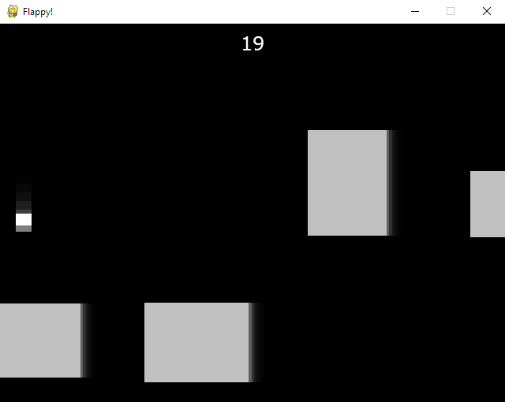

# Flappy!



This is my attempt at Flappy Bird style clone.

You are a rectangular bird flying through what seems to be outer space, with rectangular asteroids blocking your path.

However, for some reason there is gravity in space. Just keep flapping, and don't question it!

Why did I make it like this? Because I just like it.


## Cloning this thing

First, install Python, duh...

(I coded this thing on 3.13.5, so I'd get that version or something later)

Clone the repo.

```
git clone https://github.com/Carstyle476/flappy
cd flappy
```

Install required packages. (Literally just pygame)

```
pip install -r requirements.txt
```

Then you can run the game.

```
py flappy.py
```

The "release" is a .zip file containing flappy.py, requirements.txt, and the sounds folder.

This is all you need.

Enjoy!

[Credits](CREDITS.md)
